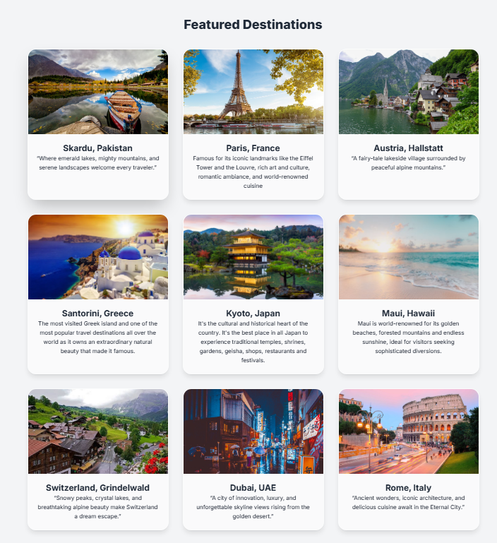
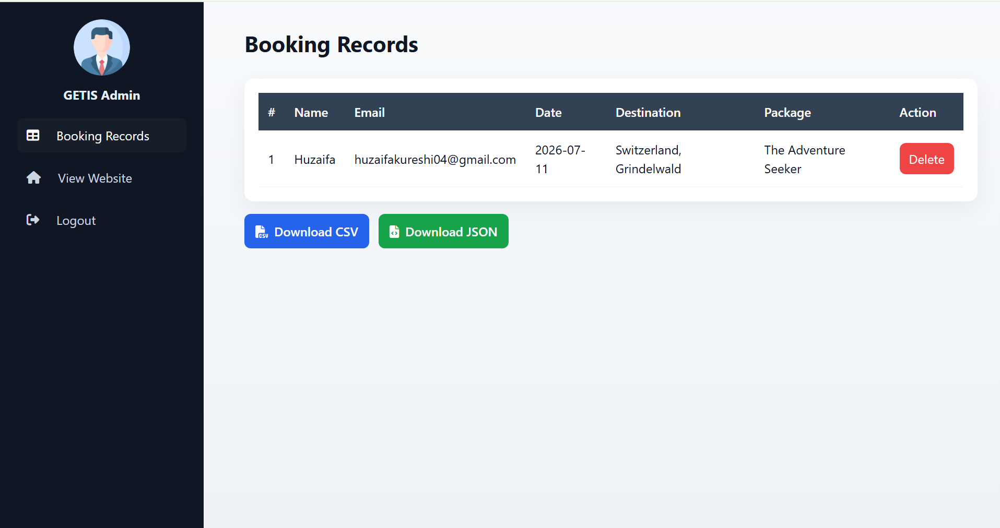
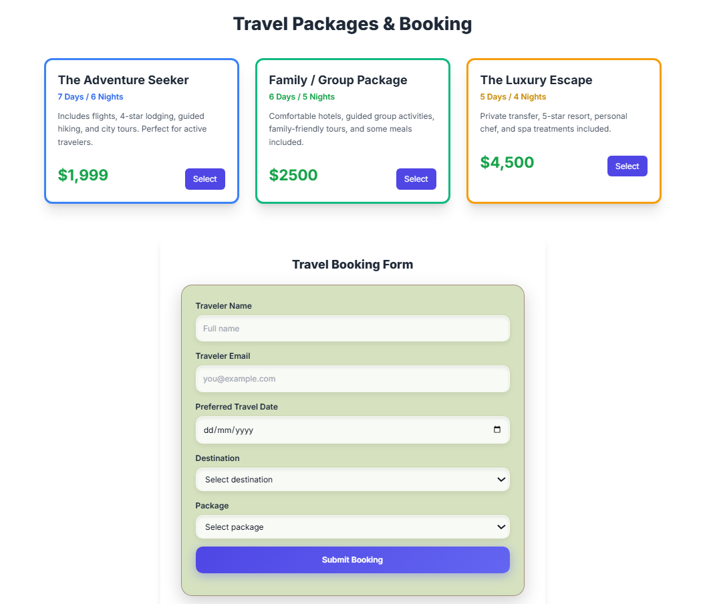
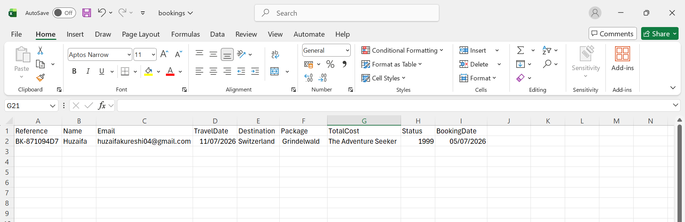

# GETIS — Global Explorer Tourism Information System

A full-stack tourism package booking system built with **ASP.NET Core** and **vanilla JavaScript**. Travelers can browse packages and submit bookings from the website; admins can review, export, and manage those bookings from a protected dashboard — all backed by a real database instead of browser storage.


---

## Overview

GETIS started as a client-side prototype (bookings saved to `localStorage`, a hardcoded admin password in JavaScript). This version replaces that with a proper client-server architecture:

- A **C# Web API** (ASP.NET Core 8 + Entity Framework Core) owns all data and business logic.
- A **static HTML/CSS/JS frontend** talks to that API exclusively over `fetch()` — no data is stored in the browser beyond a short-lived admin session token.
- Data is persisted in a **SQLite** database, created and seeded automatically on first run.

## Screenshots

| Public Booking Site | Admin Dashboard |
|----------------------|------------------|
|  |  |

| Booking Form | CSV Export |
|--------------|------------|
|  |  |

> ⚠️ GitHub's file storage is case-sensitive. If you ever rename or re-save these
> screenshots with a lowercase `.png` extension, update the paths above to match —
> otherwise the images won't render on GitHub even though they work fine locally.

## Features

- 🧳 Browse travel packages and submit a booking from the public site
- 🗂️ Bookings, travelers, and packages persisted in a relational database (SQLite via EF Core)
- 🔐 Token-protected admin dashboard to view, delete, and export bookings
- 📄 CSV and JSON export of booking records
- 📘 Auto-generated Swagger/OpenAPI docs in development mode
- 🌐 CORS-enabled API, so the frontend can be hosted separately if needed

## Tech Stack

| Layer      | Technology                                   |
|------------|-----------------------------------------------|
| Backend    | ASP.NET Core 8 Web API, C#                    |
| Database   | SQLite via Entity Framework Core              |
| Frontend   | HTML5, CSS3, vanilla JavaScript (`fetch` API) |
| API Docs   | Swashbuckle (Swagger UI)                      |

## Project Structure

```
GETIS/
├── backend/
│   └── GETIS.Api/
│       ├── Controllers/        # AuthController, BookingsController, PackagesController
│       ├── Models/             # Traveler, Package, Booking (EF Core entities)
│       ├── Dtos/                # Request/response contracts
│       ├── Data/                 # AppDbContext + DbSeeder
│       ├── Filters/               # AdminAuthAttribute (protects admin routes)
│       ├── wwwroot/               # Frontend: index.html, admin.html, script.js, styles
│       ├── Program.cs
│       └── appsettings.json
└── docs/
    └── screenshots/                # Screenshots used in this README
```

## Architecture

```
 Browser (wwwroot)                 ASP.NET Core Web API
┌───────────────────┐            ┌───────────────────────┐
│ index.html         │  fetch()   │ PackagesController     │
│ admin.html          │ ─────────▶│ BookingsController      │───▶ EF Core ───▶ SQLite (getis.db)
│ script.js            │           │ AuthController           │
└───────────────────┘            └───────────────────────┘
```

| Endpoint                          | Method | Access | Purpose                              |
|-----------------------------------|--------|--------|---------------------------------------|
| `/api/packages`                   | GET    | Public | List available travel packages        |
| `/api/bookings`                   | POST   | Public | Submit a new booking                  |
| `/api/bookings`                   | GET    | Admin  | List all bookings                     |
| `/api/bookings/{id}`              | DELETE | Admin  | Delete a booking                      |
| `/api/bookings/export/csv`        | GET    | Admin  | Download all bookings as CSV          |
| `/api/bookings/report/by-month`   | GET    | Admin  | Booking counts grouped by month       |
| `/api/auth/login`                 | POST   | Public | Authenticate and receive admin token  |

Admin routes are protected by a demo-grade `X-Admin-Token` header, issued at login and validated by `AdminAuthAttribute`. See [Security Notes](#security-notes) before using this in production.

## Getting Started

### Prerequisites

- [.NET SDK 8.0+](https://dotnet.microsoft.com/download)
- [Visual Studio Code](https://code.visualstudio.com/) with the **C# Dev Kit** extension (recommended)

### Run locally

```bash
git clone https://github.com/<your-username>/<your-repo>.git
cd GETIS/backend/GETIS.Api
dotnet restore
dotnet run
```

The console will print the local URL, e.g. `http://localhost:5000`. The API and frontend are served from the same process:

| URL                              | Description                          |
|-----------------------------------|--------------------------------------|
| `/`                                | Public booking site                  |
| `/admin.html`                      | Admin dashboard                      |
| `/swagger`                          | Interactive API docs (dev mode only) |

Default admin credentials (change these in `appsettings.json` before deploying):

```
Username: admin
Password: admin123
```

On first run, EF Core creates `getis.db` in `backend/GETIS.Api/` and seeds it with three starter packages. Delete this file at any time to reset the data.

### Running frontend and backend separately

The API has CORS enabled for all origins, so the frontend can be served independently (e.g. with the VS Code Live Server extension). Update the API base URL in `wwwroot/script.js`:

```js
const API_BASE = 'http://localhost:5000/api';
```

## Security Notes

This project uses a simplified token scheme for admin auth (a static token issued on login, checked via request header) rather than industry-standard JWT with hashed credentials. That's intentional for a learning project — before deploying this anywhere real users can reach it, consider:

- Replacing `AdminAuthAttribute` with ASP.NET Core's built-in JWT bearer authentication
- Hashing the admin password (e.g. with `BCrypt.Net`) instead of storing it in plain text
- Moving secrets out of `appsettings.json` into environment variables or `dotnet user-secrets`

## Roadmap

- [ ] JWT-based authentication with hashed passwords
- [ ] EF Core Migrations in place of `EnsureCreated()`
- [ ] Booking status workflow (Pending → Confirmed / Cancelled) from the admin dashboard
- [ ] Production-ready database (PostgreSQL/SQL Server) option
- [ ] Automated tests for controllers and business logic

## License

This project is available under the [MIT License](LICENSE).